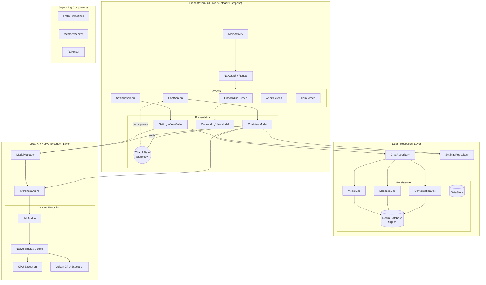

<div align="center">

# OfflineLLM

### Fully Local AI Chat on Android


A fully local/offline Android LLM application built with Kotlin and Jetpack Compose that runs language-model inference directly on the device using a native JNI-based inference engine.

</div>

---

## Table of Contents

- [System Architecture](#system-architecture)
- [Key Features](#key-features)
- [Tech Stack](#tech-stack)
- [Prerequisites](#prerequisites)
- [Getting Started](#getting-started)
- [Running the Application](#running-the-application)
- [Project Structure](#project-structure)
- [How the Application Works](#how-the-application-works)
- [LLM Inference Pipeline](#llm-inference-pipeline)
- [Data Persistence](#data-persistence)
- [Model Management](#model-management)
- [Chat Flow](#chat-flow)
- [Export Flow](#export-flow)
- [Architecture Decisions](#architecture-decisions)
- [Performance / Hardware Acceleration](#performance--hardware-acceleration)
- [Troubleshooting](#troubleshooting)
- [License](#license)

---

## System Architecture

OfflineLLM strictly adheres to a modern **MVVM + Repository** architecture pattern. What sets it apart is the total absence of a remote backend. The application relies entirely on on-device processing via a native `ggml` backend bridged through JNI.

**100% LOCAL / OFFLINE — NO REMOTE AI BACKEND**



---

## Key Features

### 🧠 Local LLM Inference
All language model processing is performed directly on the Android device. The application bridges Kotlin logic to a highly optimized C++ `ggml` backend (via `llama.cpp` integration), completely removing the need for cloud API keys or internet connectivity.

### 💬 Streaming Chat
Responses are generated and streamed token-by-token directly into the Jetpack Compose UI, creating a fluid, real-time typing effect indistinguishable from cloud-based AI apps.

### 💾 Local Conversation Storage
Every conversation, prompt, and LLM response is persisted securely to the device's internal storage via Room and SQLite. 

### 🤖 Model Management
Users can dynamically load, swap, and unload GGUF model files. The `ModelManager` securely handles model file metadata and coordinates memory allocation with the native backend.

### ⚡ CPU / Vulkan Execution
The inference engine leverages multi-threaded CPU execution by default and can dynamically offload matrix multiplications to the device's GPU via Vulkan for significantly accelerated token generation.

### 🔒 Offline & Privacy First
Because there is no remote AI backend, your prompts, context, and generated responses never leave your phone. 

### 📤 Chat Export
Easily export your chat histories. The app utilizes `kotlinx.serialization` to bundle chats into JSON format and pushes them to the native Android Share Intent.

### 🔊 Text-to-Speech & 🧠 Memory Monitoring
Features a `TtsHelper` for reading AI responses aloud and a `MemoryMonitor` to ensure the device has sufficient RAM before attempting to load large LLM weights into memory.

---

## Tech Stack

| Layer | Technology |
|---|---|
| **Language** | Kotlin |
| **UI** | Jetpack Compose, Material 3 |
| **Architecture** | MVVM + Repository Pattern |
| **State Management** | StateFlow, MutableStateFlow |
| **Navigation** | Jetpack Navigation Compose |
| **Dependency Injection**| Dagger Hilt |
| **Database** | Room / SQLite |
| **Preferences** | DataStore / SharedPreferences |
| **Concurrency** | Kotlin Coroutines (`viewModelScope`, Dispatchers) |
| **AI Runtime** | Local `InferenceEngine` |
| **Native Bridge** | JNI (Java Native Interface) |
| **Native Runtime** | C++, `ggml`, `llama.cpp` wrapper (`SmolLM`) |
| **GPU Acceleration** | Vulkan |

---

## Prerequisites

To build and run OfflineLLM from source, ensure your development environment is configured with:

- **Android Studio** (Koala or newer recommended)
- **Android SDK** (Min SDK 33, Target SDK 37)
- **Android NDK** (Required for compiling `ggml` and C++ bindings)
- **CMake** (Required by Gradle for native builds)
- **JDK 17** (Required for Gradle build steps)

---

## Getting Started

1. **Clone the repository:**
   ```bash
   git clone https://github.com/your-org/OfflineLLM.git
   cd OfflineLLM
   ```

2. **Initialize Submodules** (Crucial for `llama.cpp`):
   ```bash
   git submodule update --init --recursive
   ```

3. **Open the Project:**
   Open Android Studio and select **File > Open**, then navigate to the cloned `OfflineLLM` directory.

4. **Sync Gradle:**
   Allow Android Studio to sync the Gradle files. It will automatically detect CMake and the NDK to compile the native `smollm` module.

---

## Running the Application

1. Connect an Android device running Android 13 (API 33) or higher, or start an Android Emulator. *(Note: Vulkan acceleration works best on physical devices).*
2. Click the **Run** button (▶) in Android Studio.
3. Upon first launch, complete the **Onboarding** flow.
4. **Load a Model**: Navigate to settings to configure or load your first local `.gguf` model.
5. Return to the main screen and begin chatting.

---

## Project Structure

```text
OfflineLLM/
├── app/                        # Main Android application module
│   ├── src/main/java/com/mukassir/airgap/
│   │   ├── ai/                 # InferenceEngine, ModelManager
│   │   ├── data/               # Room Database, DAOs, Repositories
│   │   ├── di/                 # Dagger Hilt Modules
│   │   ├── ui/                 # Jetpack Compose Screens, Navigation, Theme
│   │   └── utils/              # MemoryMonitor, TtsHelper, FileUtils
│   └── build.gradle.kts
├── smollm/                     # Native JNI wrapper module
│   ├── src/main/cpp/           # C++ JNI bridge code
│   └── src/main/java/          # Kotlin native interface definitions
├── llama.cpp/                  # Core ggml C++ inference engine (submodule)
├── gradle/                     # Gradle wrapper
├── build.gradle.kts            # Project root configuration
└── settings.gradle.kts
```

---

## How the Application Works

### 1. Application Launch
The app enters through `MainActivity`, which hosts a Jetpack Compose `NavGraph`. The user is routed to the `OnboardingScreen` (if it's their first time) or directly into the `ChatScreen`.

### 2. User Sends a Message
When a user types a prompt:
- `ChatScreen` sends an intent to `ChatViewModel.sendMessage()`.
- The user's prompt is saved immediately to the local Room database via `ChatRepository`.
- The ViewModel triggers `InferenceEngine.generateResponse()`.

### 3. Token Streaming
The `InferenceEngine` communicates over JNI to the `SmolLM` C++ engine. As the C++ backend generates tokens (on the CPU or Vulkan GPU), it fires callbacks to Kotlin. The `ChatViewModel` batches these tokens and updates the `ChatUiState.partialResponse` `StateFlow`, triggering a fluid UI recomposition.

### 4. Conversation Persistence
Once the native engine emits an end-of-sequence token, generation stops. The `ChatViewModel` clears the partial state and saves the complete assistant response to the SQLite database.

---

## LLM Inference Pipeline

The native pipeline is entirely decoupled from the UI thread:

1. **`ChatViewModel`** delegates a generation request to the **`InferenceEngine`**.
2. **`InferenceEngine`** calls into the **JNI Bridge**.
3. **Native `SmolLM` / `ggml`** allocates tensors and computes matrix multiplications against the loaded model weights.
4. Work is distributed across the **CPU** threads or offloaded to the **Vulkan GPU**.
5. Emitted string tokens are marshaled back across JNI into Kotlin and pushed into a Coroutine Flow.

---

## Data Persistence

All data is strictly local:

- **Room Database / SQLite:** 
  - `ConversationDao`: Manages chat session metadata (Titles, timestamps).
  - `MessageDao`: Maps individual prompts and responses to a conversation via Foreign Keys.
  - `ModelDao`: Tracks localized model file paths, configurations, and metadata.
- **SettingsRepository:** Wraps DataStore/SharedPreferences to store user configurations (e.g., active model, system prompt, context window size).

---

## Model Management

Handled by `ModelManager`, the app allows users to:
- Load `.gguf` files from device storage.
- The manager checks device RAM via `MemoryMonitor` before allowing a load.
- If settings change (e.g., context size increases), the `ModelManager` gracefully unloads the C++ engine to free native memory before reloading the model with the updated parameters.

---

## Chat Flow

<div align="center">

User → **Compose ChatScreen** → `sendMessage()` → **Save User DB** → **Local LLM Generate** → **Token Streaming UI** → **Save Assistant DB**

</div>

---

## Export Flow

Users can securely back up their offline chats. 
- The user selects "Export" in Settings/Drawer.
- `ChatViewModel.exportChats()` queries the `ChatRepository` for all DB records.
- The records are serialized into structured JSON using `kotlinx.serialization`.
- An Android standard `ACTION_SEND` intent is fired, allowing the user to save the `.json` file locally or share it.

---

## Architecture Decisions

### MVVM + Repository
Separating the Compose UI from the business logic ensures that configuration changes (like screen rotations) don't interrupt long-running LLM inference tasks. The `Repository` layer ensures the ViewModel never touches Room/SQL directly.

### JNI & C++ Abstraction
By encapsulating `llama.cpp` behind a strict `SmolLM` interface and exposing it via an `InferenceEngine` wrapper, the Android application remains decoupled from the low-level memory management of the native layer.

### Async Token Yielding
UI thread blocking is completely avoided. Native C++ token generation loops are suspended and dispatched to `Dispatchers.Default`, ensuring the app remains perfectly smooth and responsive while heavy computation happens in the background.

---

## Performance / Hardware Acceleration

- **Vulkan GPU Offloading:** If supported by the device, `ggml` will offload tensor computations to the GPU, significantly increasing Tokens-per-Second (Tk/s) and reducing battery drain.
- **Graceful Fallback:** If Vulkan allocation fails due to driver instability or VRAM limits, the `InferenceEngine` automatically catches the exception and retries the load purely on the CPU.
- **UI Batching:** The ViewModel batches incoming stream tokens (e.g., updating the UI every 3 tokens) to prevent Jetpack Compose from over-recomposing and dropping UI frames during fast generation.

---

## Troubleshooting

- **Gradle Native Build Fails:** Ensure you have installed CMake and the NDK via the Android Studio SDK Manager. Ensure the `llama.cpp` submodule was checked out properly.
- **Model Fails to Load:** Ensure the model is in the GGUF format. If the app crashes on load, check the logcat for `std::bad_alloc` — you may be trying to load a model larger than your device's available RAM.
- **Vulkan Crash:** Some Android devices have highly experimental Vulkan drivers. If the app crashes during generation, go to Settings and force CPU-only execution.

---

## License

*(Specify the license here, e.g., MIT, Apache 2.0. If using `llama.cpp`, ensure compliance with the MIT license).*
